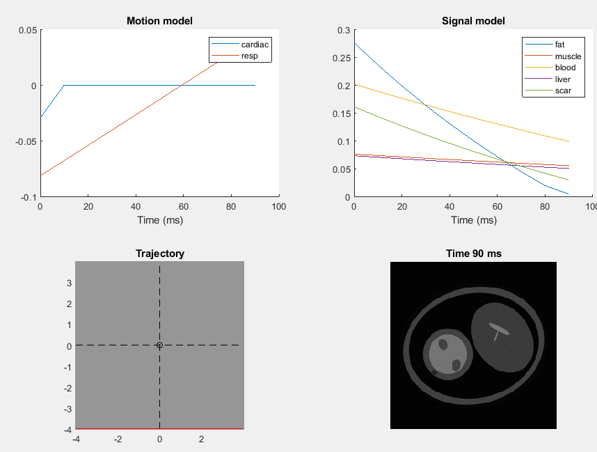

# nhlbi_matlab

Some resources to run
- offline MRD (h5/ISMRMRD) recon in matlab.
- dicom and Siemens-MRI handling
- simple k-space simulation

## Offline MRD recon    
Current examples for simple
- spectrum
- cartesian (fully-sampled)
- spiral (Hargreaves - archimedean design)

## Simple k-space simulation
Designed to be flexible for any trajectories and signal profiles
Requires other packages, see help!

